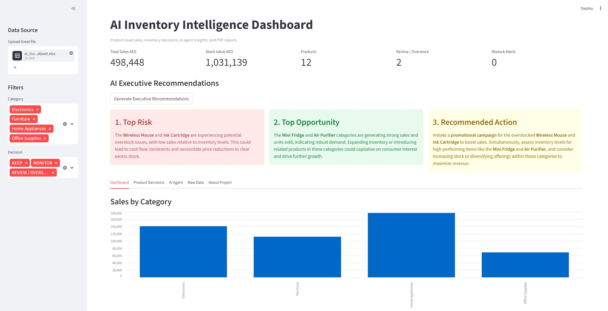

# AI Inventory Intelligence Dashboard

An AI-powered inventory analytics application that moves beyond static reporting — combining rule-based decision logic with LangChain agents, OpenAI-generated executive insights, and automated PDF reporting.

Built to reflect real supply chain dynamics common in USA Market.

---

## Screenshot



---

## What It Does

Most dashboards show data. This one recommends decisions.

The application analyses product-level sales and stock data, classifies every product into one of four decision categories, and uses an AI agent to answer business questions and generate executive-level recommendations — all exportable as a PDF report.

**Decision logic:**
| Decision | Condition |
|---|---|
| RESTOCK | High sales (≥ 30K AED) + low stock (≤ 20 units) |
| KEEP | High sales (≥ 30K AED) + adequate stock |
| REVIEW / OVERSTOCK | Low sales (< 15K AED) + excess stock (> 100 units) |
| MONITOR | Everything else |

---

## Tech Stack

| Layer | Tools |
|---|---|
| Data | Python · pandas · Excel |
| AI | OpenAI API · LangChain |
| Dashboard | Streamlit |
| Reporting | ReportLab PDF |

---

## Features

- **KPI Summary** — Total sales, stock value, product count, restock alerts
- **AI Executive Recommendations** — Top Risk, Opportunity, and Action generated by LangChain
- **AI Business Agent** — Selects the most relevant analytical tool per question, returns business insight
- **PDF Export** — Downloadable executive report per session
- **Sidebar Filters** — Filter by category and decision type
- **Raw Data View** — Full sales, stock, and product tables

---

## How to Run


**1. Install dependencies**
```bash
pip install streamlit pandas openai langchain langchain-openai python-dotenv reportlab openpyxl
```

**2. Add your OpenAI API key**

Create a `.env` file in the root folder:
```
OPENAI_API_KEY=your-key-here
```

**3. Run the app**
```bash
streamlit run streamlit_app.py
```

**4. Upload your Excel file**

Use the sidebar to upload your Excel file with three sheets: `Sales`, `Stock`, and `Products`.

---

## Project Structure

```
ai-inventory-intelligence/
├── streamlit_app.py     # Main application
├── .env                 # API key (not committed)
├── .gitignore           # Excludes .env and data files
└── README.md            # This file
```

---

